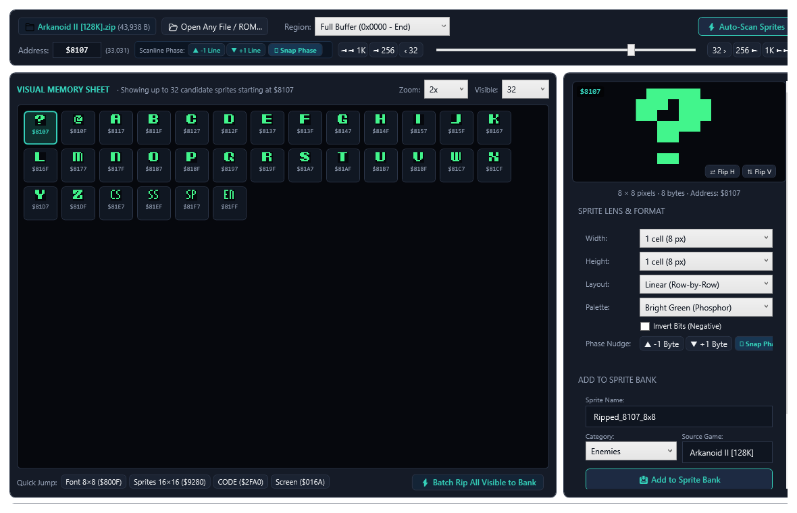
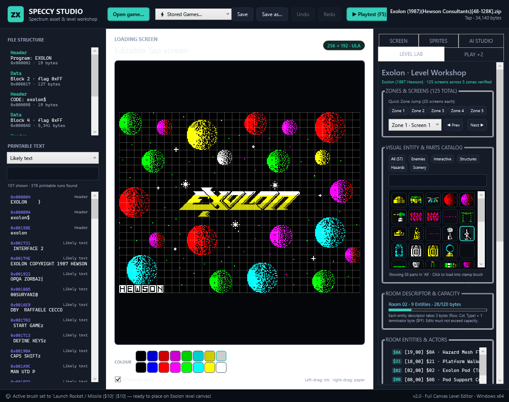
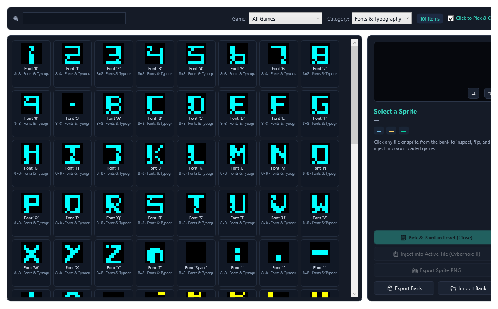
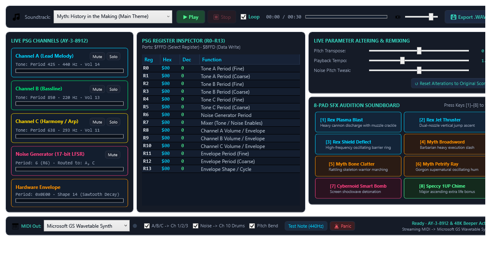

# 🕹️ Speccy Studio

[](https://dotnet.microsoft.com/)
[](https://microsoft.com)
[](LICENSE)
[]()
[]()

> **The Ultimate ZX Spectrum Reverse Engineering, Asset Extraction, Level Editing & Chiptune MIDI Workstation.**

Speccy Studio is a modern, dependency-free native Windows application (.NET 8 WPF) designed to inspect, edit, reverse-engineer, and extract graphics, levels, typography, and chiptunes from classic ZX Spectrum 48K/128K snapshots and tape images (`.scr`, `.tap`, `.tzx`, `.sna`, `.z80`).

---

## 📸 Visual Tour

### 1. In-App Visual Memory & ROM Ripper
Rip sprites, fonts, and graphics directly from raw 64KB RAM snapshots with automatic cluster detection, phase-alignment correction, and real-time visual memory scanlines.


### 2. Multi-Game Reverse-Engineered Level Editor
Explore, re-route, and redesign levels for iconic Spectrum titles including **Cybernoid II** (all 58 rooms with collision logic and room transitions), **Exolon**, **Rex**, and **Myth**.


### 3. Sprite Bank & Hand-Crafted Font Inspector
Extract custom 8×8 typography, directional sprites, and visual entity catalogues from game binaries and export them to standard PNG or clipboard.


### 4. Chiptune Audio Studio with Live Windows MIDI Out
Stream 128K AY-3-8912 PSG chiptunes and sound effects in real time to external DAWs (Ableton, FL Studio, Reaper, Cubase) and VST3 synthesizers with 14-bit microtonal pitch bending.


---

## ✨ Key Features

### 🔍 In-App Visual Memory & ROM Ripper
* **Real-time Memory Scanning**: Visualise any RAM address range ($0000–$FFFF) with variable stride (1 to 8 bytes wide) and zoom levels up to 8×.
* **Auto-Find Sprites & Clusters**: Automatically scans unmapped RAM for coherent graphics, detecting bounding boxes, repeating patterns, and contiguous sprite banks.
* **Phase & Byte-Shift Alignment**: Features automatic phase calculation to detect and correct +1 to +7 byte stride offsets that cause cut-off sprite tops.
* **Live Export**: Copy discovered sprites and fonts directly to the active Level Brush, Sprite Bank, or export as clean PNGs.

### 🗺️ Multi-Game Level Lab & Room Editors
* **Cybernoid II (1988)**:
  * Decodes all 58 rooms across 4 cavern levels.
  * Native 16×10 room tile grid editor with verified collision roles (Clear, Partial, Solid, Runtime Marker).
  * Room exit and transition graph navigation matching original Z80 engine logic.
  * Recompresses changed rooms with Cybernoid's native token engine (Literal, RLE, Pair, and Triple tokens).
* **Exolon (1987)**:
  * Full screen structure decoding, tile attribute mapping, and interactive entity brush.
* **Rex & Myth**:
  * Engine screen cleaner, visual entity catalogue parsing, sprite bank extraction, and custom font dumping.
* **Non-Destructive Tile Flipping**: Isolated tile flipping that clones and remaps without mutating shared atlas tiles.

### 🎹 Chiptune Audio Studio & Live MIDI Output
* **Windows Multimedia API Integration**: Built-in zero-latency `winmm.dll` MIDI Out driver.
* **Multi-Channel Hardware Voice Routing**:
  * **MIDI Ch 1**: AY Channel A (Lead / Melody)
  * **MIDI Ch 2**: AY Channel B (Harmony / Arpeggiator)
  * **MIDI Ch 3**: AY Channel C (Bass)
  * **MIDI Ch 10**: AY LFSR Noise Generator mapped to General MIDI Percussion (Bass Drum, Snare, Hi-Hats, Crash).
* **14-Bit Microtonal Pitch Bending**: Accurately reproduces AY-3-8912 logarithmic frequencies ($F = \frac{1,773,400}{16 \times TP}\text{ Hz}$) with high-resolution pitch bend messages.
* **Interactive Soundboard**: 16 programmable SFX trigger pads mapped to direct MIDI note outputs.
* **Hardware Controls**: Live Pulsing Cyan Activity LED, device selector dropdown, and one-click `🚨 MIDI Panic` (All Notes Off).

---

## 🎧 Connecting to DAWs & VST3 Plugins

Speccy Studio can drive any modern virtual synthesizer or vocoder in your digital audio workstation:

1. **Virtual MIDI Cable**: Install a virtual MIDI loopback driver such as [loopMIDI](https://www.tobias-erichsen.de/software/loopmidi.html).
2. **Device Selection**: In Speccy Studio's Audio Studio, choose `loopMIDI Port` in the MIDI Output dropdown.
3. **DAW Setup (Ableton / FL Studio / Reaper / Cubase)**:
   * Enable `loopMIDI Port` as an active MIDI input.
   * Route **MIDI Channel 1** to your lead synthesizer / vocoder plugin.
   * Route **MIDI Channel 2** to an arpeggiator or pad synthesizer.
   * Route **MIDI Channel 3** to a bass synthesizer.
   * Route **MIDI Channel 10** to a drum machine or sample sampler.
4. **Out-of-the-Box Playback**: No external software needed — select `Microsoft GS Wavetable Synth` to listen instantly through Windows default General MIDI.

---

## 🚀 Building & Running from Source

### Prerequisites
* Windows 10 or 11 (64-bit)
* [.NET 8.0 SDK](https://dotnet.microsoft.com/download/dotnet/8.0) or Visual Studio 2022 (v17.8+)

### Build
Clone the repository and build the complete solution:

```powershell
git clone https://github.com/<your-username>/SpeccyStudio.git
cd SpeccyStudio
dotnet build SpeccyStudio.sln -c Release
```

### Run Smoke Tests
Run the comprehensive automated test suite (verifies 14 subsystem tests including screen codecs, room compression, memory ripper, phase calculations, and audio engines):

```powershell
dotnet run --project SpeccyStudio.SmokeTests -c Release
```

### Publish Single-File Executable
```powershell
dotnet publish SpeccyStudio\SpeccyStudio.csproj -c Release -r win-x64 --self-contained false -o bin\Publish
```

---

## ⚖️ Legal & Copyright Notice

* Speccy Studio does **not** bundle copyrighted commercial game ROMs, snapshots, or proprietary tape dumps.
* Users must supply their own legally obtained `.sna`, `.tap`, `.tzx`, or `.z80` snapshot and tape files.
* Sinclair ZX Spectrum system ROM trademarks are the intellectual property of Amstrad plc / Sky UK and used under established non-commercial hobbyist distribution guidelines.
* Speccy Studio is released under the permissive [MIT License](LICENSE).
